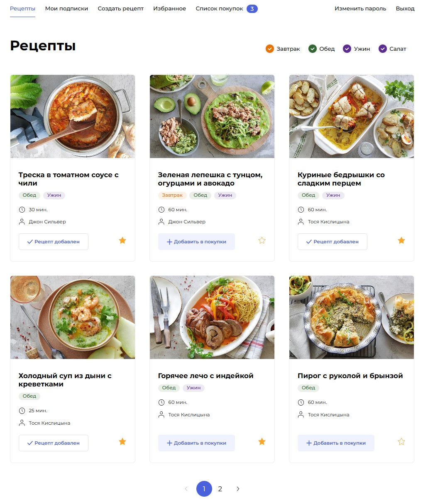

#### :book: Описание проекта
---
Foodgram - «Продуктовый помощник» - это онлайн-сервис, где пользователи могут публиковать рецепты, подписываться на публикации других пользователей, добавлять понравившиеся рецепты в список «Избранное», а перед походом в магазин скачивать сводный список продуктов, необходимых для приготовления одного или нескольких выбранных блюд.

Это учебный проект, который состоит из бэкенд-приложения на Django и фронтенд-приложения на React. Фронтенд приложение стандартное, и является материалом, предоставленным [Яндекс Практикум](https://practicum.yandex.ru/) вместе с заданием. Бэкенд приложение - это дипломная работа, выполненная в соответствии с предоставленной Яндекс Практикумом спецификацией.


#### :rocket: Запуск проекта на локальном компьютере:
---
- Клонировать репозиторий и перейти в него в командной строке:
```bash
git@github.com:Olkhovik-mv/foodgram-project-react.git
cd foodgram-project-react/
```
- В директории foodgram-project-react/ создать файл `.env` и заполнить его по образцу `.env.example`
- Запустить на компьютере `docker daemon`
- Запустить Docker Compose:
```bash
docker compose up -d
```
- Собрать статику
- Скопировать статику в директорию `/backend_static/`, связанную с volume `static`
- Применить миграции
- Импортировать данные в таблицу `Foodstuff`
- Создать суперпользователя
```bash
docker compose exec backend python manage.py collectstatic
docker compose exec backend cp -r /app/collected_static/. /backend_static/static/
docker compose exec backend python manage.py migrate
docker compose exec backend python manage.py importdata
docker compose exec backend python manage.py createsuperuser
```
- Проект доступен в браузере по адресу: http://localhost:8000
- Зайти в админ-зону проекта http://localhost:8000/admin/ и заполнить таблицу `Tags`.


#### :hammer_and_wrench: Технологии:
---
<div>
  &nbsp;
  &nbsp;
  &nbsp;
  &nbsp;
  &nbsp;
  &nbsp;
  &nbsp;
  &nbsp;
  &nbsp;
  &nbsp;
  &nbsp;
  &nbsp;
</div>

#### :man_technologist: Aвторы:
---
- [Яндекс Практикум](https://github.com/yandex-praktikum)
- [Михаил Ольховик](https://github.com/Olkhovik-mv)